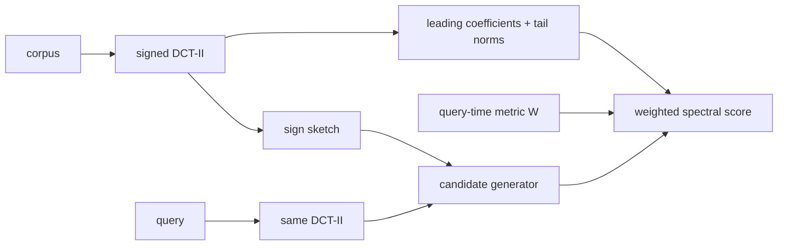

<p align="center">
<picture>
  <source media="(prefers-color-scheme: dark)" srcset="/.github/images/zenith.jpg">
  <source media="(prefers-color-scheme: light)" srcset="/.github/images/zenith.jpg">
  
</picture>
</p>

# ZENITH

**Z**ero-rebuild **E**igenmetric **N**earest-neighbor **I**ndex with **T**unable **H**yperplanes

ZENITH is a small header-only C library for a very specific problem: you have a static collection of vectors, a fixed orthonormal spectral basis, and many diagonal spectral metrics you want to try at query time without rebuilding the index.

The public API is `include/zenith.h`. Compile-time SIMD kernels and the reserved CUDA slot live under `include/zenith/arch/`. The DCT-II projector and OpenMP helpers live under `include/zenith/`. One translation unit defines `ZENITH_IMPLEMENTATION`.

The library's trick is simple. Positive coordinate scaling does not change a coordinate's sign. ZENITH therefore stores one sign sketch and one retained spectral representation, then re-scores candidates under a new positive diagonal metric at query time. That is not the same thing as guaranteeing exact nearest neighbors under every possible metric.

The right way to think about ZENITH is as a **candidate generator plus a principled leading-subspace ranker**. If you need contractual exactness, run it with `Mcoef == D` and `ef == N`, or use the approximate path to propose candidates and `zenith_rerank_exact()` to finish the job.

Version 1.0.0.

> [!IMPORTANT]
> Changing the metric `W` changes nearest-neighbor order. The sketch proposes; the weighted score ranks. Approximate search is not exact kNN.

---

## Table of contents

- [When to use it](#when-to-use-it)
- [Quick start](#quick-start)
- [Build](#build)
- [A minimal query](#a-minimal-query)
- [Mathematical overview](#mathematical-overview)
- [Spectral metrics and fBm](#spectral-metrics-and-fbm)
- [Why DCT-II?](#why-dct-ii)
- [Choosing the knobs](#choosing-the-knobs)
- [Benchmarks](#benchmarks)
  - [Same hardware: dense / 1-thread vs FFTW3 / OpenMP](#same-hardware-dense--1-thread-vs-fftw3--openmp)
- [Pareto frontier](#pareto-frontier)
- [Tests](#tests)
- [Examples](#examples)
- [Persistence](#persistence)
- [Limitations](#limitations)
- [License](#license)

---

## When to use it

Use ZENITH when all four are true:

1. **The corpus is static.** Build once; query many times.
2. **The basis is fixed.** The implementation uses DCT-II, optionally preceded by a deterministic diagonal sign flip.
3. **The metric changes at query time.** In particular, you care about positive diagonal weights in spectral space: Sobolev, Matérn-style, fractional-Laplacian, rough-volatility, or custom penalties.
4. **Approximate candidates are acceptable**, or you are willing to pay for exhaustive/exact re-ranking when needed.

It is not a substitute for a generic nearest-neighbor library. On unstructured high-dimensional Gaussian data, the measured recall is poor unless you scan nearly everything. That isn't an oversight; it's the geometry of the problem. There are plenty of excellent solutions out there for Gaussian data.

Good fits:

- signals, images, surfaces, and curves with meaningful low-frequency energy;
- rough or smooth stochastic objects where a spectral metric is economically or scientifically meaningful;
- model exploration, where the metric is part of the experiment (a Hurst index, a Matérn smoothness, a Sobolev order);
- candidate generation before a smaller exact re-rank.

Bad fits:

- dynamic corpora with frequent inserts and deletes;
- arbitrary learned metrics with dense matrices;
- structureless embeddings where sign sketches carry little locality;
- applications that need exact top-`k` under arbitrary `W` but refuse to scan or re-rank.

---

## Quick start

ZENITH is header-only. Include `zenith.h` and, in exactly one translation unit, compile the implementation:

```c
#define ZENITH_IMPLEMENTATION
#include "zenith.h"
```

In every other translation unit:

```c
#include "zenith.h"
```

The implementation pulls in these private headers (you do not include them yourself):

```text
include/
├── zenith.h                 public API
└── zenith/
    ├── dct.h                DCT-II projector (dense or FFTW)
    ├── threads.h            OpenMP / serial helpers
    └── arch/                interchangeable architecture kernels
        ├── simd.h           compile-time SIMD selector
        ├── simd_avx512.h
        ├── simd_avx2.h
        ├── simd_neon.h
        ├── simd_scalar.h
        └── cuda.h           reserved GPU slot
```

Compile with C99 or later, add `include/` to the search path, and link `libm` on Unix-like systems:

```sh
cc -O3 -std=c99 -Iinclude your_program.c -lm
```

For local benchmarking with FFTW3 and OpenMP:

```sh
cc -O3 -march=native -mtune=native -fopenmp -Iinclude your_program.c -lm -lfftw3f
```

SIMD kernels (AVX-512, AVX2+FMA, NEON, or scalar) are selected at compile time from `include/zenith/arch/`. There is no runtime dispatch.

---

## Build

The project ships a CMake toolchain. A correctness build:

```sh
cmake -S . -B build -DCMAKE_BUILD_TYPE=Release
cmake --build build --parallel
ctest --test-dir build --output-on-failure
```

The numbers in [Benchmarks](#benchmarks) come from a local performance build. Release is `-O3`; turn on native ISA, FFTW3, and OpenMP:

```sh
CC=gcc cmake -S . -B build -DCMAKE_BUILD_TYPE=Release \
  -DZENITH_ENABLE_NATIVE=ON \
  -DZENITH_USE_FFTW=ON \
  -DZENITH_USE_OPENMP=ON \
  -DZENITH_BUILD_BENCHMARKS=ON
cmake --build build --parallel
```

Useful options:

```sh
-DZENITH_BUILD_TESTS=ON
-DZENITH_BUILD_BENCHMARKS=ON
-DZENITH_BUILD_EXAMPLES=ON
-DZENITH_ENABLE_NATIVE=ON       # -march=native -mtune=native
-DZENITH_ENABLE_SANITIZERS=ON   # ASan + UBSan
-DZENITH_STRICT_WARNINGS=ON
-DZENITH_USE_FFTW=ON            # FFTW3 for large DCT-II projections
-DZENITH_USE_OPENMP=ON          # parallel build and query
```

A CUDA backend is reserved in `include/zenith/arch/cuda.h` but not built in this release.

With OpenMP, prefer `OMP_PROC_BIND=close` and `OMP_PLACES=cores` so threads stay on the NUMA node that first-touched the index arrays. `opts.nthreads` (or `zenith_set_threads()`) sets the team size for both `zenith_build()` and queries, including `zenith_query_many()`. Inner scans refuse to nest, so a batch of queries is parallelized over the batch.

FFTW is used automatically when `D` is large enough that $`O(D \log D)`$ beats the dense $`M \times D`$ projector. Set `opts.fftw > 0` to force it, or `opts.fftw < 0` to keep the dense plan.

Run the quick benchmark:

```sh
cmake --build build --target run_benchmarks
```

`run_perf_benchmarks` writes the `N=8192`, `D=256` suite into the build directory so it cannot clobber shipped CSVs.

Reproduce the bundled suites (from the build directory). The optional fourth argument is a filename tag; it defaults to the mode name so `quick` and `perf` do not overwrite each other:

```sh
# N=4096, D=64
sh ../bench/run_all.sh ./zenith_bench ../results quick o3_fftw_omp
# N=8192, D=256 (FFTW-friendly, OpenMP-friendly)
OMP_NUM_THREADS=$(nproc) OMP_PROC_BIND=close OMP_PLACES=cores \
  sh ../bench/run_all.sh ./zenith_bench ../results perf
```

The serial dense baseline is a second binary: `-DZENITH_USE_FFTW=OFF -DZENITH_USE_OPENMP=OFF`, then `sh ../bench/run_all.sh ./zenith_bench ../results perf perf_o3_serial`. Auto FFTW still fires at this `D` if FFTW was compiled in.

Install the header-only CMake target:

```sh
cmake --install build --prefix /your/prefix
```

Then consume it with:

```cmake
find_package(zenith CONFIG REQUIRED)
target_link_libraries(your_target PRIVATE zenith::zenith)
```

---

## A minimal query

```c
#define ZENITH_IMPLEMENTATION
#include "zenith.h"

#include <stdio.h>

int main(void) {
    enum { N = 1000, D = 64, M = 32, K = 10 };
    float vectors[N * D];       /* fill this */
    float q[D];                 /* and this */
    float weight[D];            /* query-time spectral metric, length D */
    uint32_t ids[K];
    float dist[K];

    zenith_opts opts;
    zenith_opts_init(&opts);
    opts.Mcoef = M;
    opts.nbits = 48;
    opts.gen = ZENITH_GEN_SIGNED_DCT;
    opts.seed = 123;
    opts.search = ZENITH_SEARCH_HYBRID;

    zenith_index_t *idx = zenith_build(vectors, N, D, opts);
    if (!idx) return 1;

    zenith_w_identity(D, weight);

    uint32_t n = zenith_query_ef(idx, q, weight, K, 128, ids, dist);
    for (uint32_t r = 0; r < n; ++r)
        printf("id=%u lower_bound=%f\n", ids[r], dist[r]);

    zenith_free(idx);
    return 0;
}
```

Query weights always have length `D`. The leading `Mcoef` entries score the retained subspace. If `Mcoef < D`, ZENITH uses the minimum of `weight[Mcoef..D)` as the certified tail floor. You do not assemble a separate `Mcoef+1` buffer. `out_dist` is the square root of the scored lower bound on $`d_W^2`$ — a lower bound on $`d_W`$, not the exact distance, unless `Mcoef == D`.

`zenith_candidates_ef()` returns the raw candidate pool in generator order before retained-distance top-`k` selection.

Zero-initialized options default to MIH candidate generation, `Mcoef = min(D, 128)`, and a 64-bit sketch (clamped to `D`). `zenith_opts_init()` is the explicit form of that. `zenith_query()` (no `ef`) uses $`\mathrm{ef}=\min(N,\max(512,24k))`$.

For exact work:

```c
zenith_query_ef(idx, q, weight, candidate_count, ef, cand_ids, cand_bounds);
zenith_rerank_exact(idx, vectors, q, weight,
                    cand_ids, candidate_count, K, out_ids, out_dist);
```

`zenith_rerank_exact()` takes the same length-`D` weight vector and the original corpus.

---

## Mathematical overview

Let $`x \in \mathbb{R}^D`$ be an input vector. ZENITH uses a deterministic signed DCT-II basis

```math
z(x) = \Phi S x
```

where:

- $`S`$ is a diagonal matrix with deterministic $`\pm 1`$ entries;
- $`\Phi`$ is the orthonormal DCT-II matrix;
- $`S`$ decorrelates signs without changing Euclidean geometry;
- $`\Phi`$ rotates into frequency space.

Because $`\Phi`$ and $`S`$ are orthogonal,

```math
\|x - y\|_2 = \|z(x) - z(y)\|_2.
```

The query-time object is a diagonal spectral metric

```math
d_W^2(x, y)
= \bigl(z(x) - z(y)\bigr)^{\top} W \bigl(z(x) - z(y)\bigr)
= \sum_{k=0}^{D-1} w_k \bigl(z_k(x) - z_k(y)\bigr)^2,
\qquad w_k \ge 0.
```



### Spectral sign invariance

Suppose you build the index under a positive baseline diagonal $`B`$ and store whitened coefficients

```math
\tilde{z}_k = \sqrt{b_k}\, z_k, \qquad b_k \gt 0.
```

Then $`\mathrm{sign}(\tilde{z}_k)=\mathrm{sign}(z_k)`$, because $`\sqrt{b_k}\gt 0`$. One sign sketch can therefore serve many reweighted metrics. Under a new diagonal `W`, the whitened-space score uses $`w_k/b_k`$:

```math
\sum_k w_k \bigl(z_k(x) - z_k(y)\bigr)^2
= \sum_k \frac{w_k}{b_k} \bigl(\tilde{z}_k(x) - \tilde{z}_k(y)\bigr)^2.
```

That is the zero-rebuild part. It is exact for the coefficients you retained. It does **not** say that every diagonal metric has the same nearest neighbors. Changing `W` changes the geometry.

### Truncation and the residual bound

ZENITH stores the leading `Mcoef` coefficients and the exact tail $`L^2`$ norm

```math
r_x = \Bigl(\|x\|_2^2 - \sum_{k \lt M} z_k(x)^2\Bigr)^{1/2} = \|\mathrm{tail}(x)\|_2.
```

For a query with tail norm $`r_q`$ and certified minimum tail weight $`w_{\mathrm{tail}} = \min_{k \ge M} w_k`$, the **internal** squared score is

```math
\underline{d}_W^2(x, q)
= \sum_{k \lt M} w_k \bigl(z_k(x) - z_k(q)\bigr)^2
+ w_{\mathrm{tail}}\, (r_x - r_q)^2.
```

The second term is a lower bound on the omitted tail energy. Reverse triangle inequality gives

```math
\|\mathrm{tail}(x) - \mathrm{tail}(q)\|_2
\ge \bigl| \|\mathrm{tail}(x)\|_2 - \|\mathrm{tail}(q)\|_2 \bigr|
= |r_x - r_q|,
```

and every omitted coordinate is weighted at least $`w_{\mathrm{tail}}`$, so

```math
\sum_{k \ge M} w_k \bigl(z_k(x) - z_k(q)\bigr)^2
\ge w_{\mathrm{tail}}\, \|\mathrm{tail}(x) - \mathrm{tail}(q)\|_2^2
\ge w_{\mathrm{tail}}\, (r_x - r_q)^2.
```

The public API returns $`\sqrt{\underline{d}_W^2}`$, a lower bound on $`d_W`$. The bound is exact when $`M = D`$ (no tail) or when at least one tail vanishes. Otherwise it is intentionally conservative.

### Candidate generation

ZENITH packs coefficient signs (or Lloyd–Max codes) into a 64-bit sketch and supports:

- **MIH**: multi-index hashing over sketch chunks, with progressive radius expansion (default cap 2). Unique hits are ranked by full-sketch Hamming distance before scoring. Sparse buckets backfill from the Gray ordering so a small `ef` still returns distinct candidates.
- **Gray**: bidirectional scan around the query's sorted Gray key.
- **Hybrid**: Hamming-ranked MIH for three-quarters of `ef`, then a Gray scan for the remainder.
- **Hamming**: true top-`ef` packed-key Hamming selection over the whole corpus.
- **Posterior**: query- and metric-weighted quantized-code posterior over the whole corpus.

`ef` is the candidate-evaluation budget. If `ef == N`, ZENITH performs an exhaustive scan of every stored representation. Radius-limited MIH does not imply full coverage. Hamming and posterior are linear in `N`; OpenMP parallelizes those scans and `zenith_query_many()` parallelizes a batch of queries.

Equal distances are broken by original vector id so ranking is deterministic.

---

## Spectral metrics and fBm

Euclidean distance treats a slow level shift and a high-frequency jitter of the same $`L^2`$ size as the same error. For curves, images, volatility paths, and spatial fields, that is almost never the geometry you want. A **spectral metric** is a price list over frequencies: $`w_k`$ is how much a mismatch at DCT mode $`k`$ costs. Low $`k`$ is shape and trend. High $`k`$ is roughness, edges, and noise.

ZENITH's built-in constructors all live on the 1D Neumann Laplacian spectrum that the DCT-II diagonalizes. Call `zenith_laplacian_eigs(D, mu)` to get

```math
\mu_k = 2\bigl(1 - \cos(\pi k / D)\bigr), \qquad k = 0,\ldots,D-1.
```

Small $`\mu_k`$ is a long wavelength; $`\mu_k`$ grows like frequency squared. Every constructor then writes a positive, nondecreasing sequence $`w_k = w(\mu_k)`$.

| Constructor | Formula | What it is |
|---|---|---|
| `zenith_w_identity` | $`w_k = 1`$ | Euclidean. Orthogonal $`\Phi S`$ makes this the ordinary $`\ell^2`$ metric. |
| `zenith_w_sobolev` | $`w_k = (1 + \mu_k)^s`$ | Discrete $`H^s`$ energy. Larger $`s`$ makes high-frequency mismatches more expensive. |
| `zenith_w_matern` | $`w_k = (\mu_k + \kappa^2)^{\nu}`$ | Inverse of a Matérn-type spectral density $`(\kappa^2 + \mu)^{-\nu}`$. `nu` is this precision exponent, not the geostatistical smoothness parameter by itself; `kappa` is a range-like cutoff. |
| `zenith_w_fractional` | $`w_k = \mu_k^s`$ | Homogeneous $`(-\Delta)^s`$ energy. Same idea as Sobolev, without the mass at $`\mu = 0`$. |
| `zenith_w_roughvol` | $`w_k = \mu_k^{2H+1}`$ | Roughness knob parameterized by Hurst index $`H`$. |

### Fractional Brownian motion

A one-dimensional fractional Brownian motion $`B^H`$ with Hurst index $`H \in (0,1)`$ is the Gaussian process whose increments look like $`|t-s|^{H}`$ in quadratic mean. The single number $`H`$ is a roughness knob:

- $`H = 1/2`$ is ordinary Brownian motion;
- $`H \lt 1/2`$ is **rougher** than Brownian — paths are more jagged, increments anti-persist. Rough volatility lives around $`H \approx 0.1`$;
- $`H \gt 1/2`$ is **smoother** and more persistent.

The power spectrum of fBm decays as a power law

```math
S_H(\omega) \propto |\omega|^{-(2H+1)}.
```

Inverting that spectrum gives the natural Mahalanobis / reproducing-kernel weights: a mismatch at frequency $`\omega`$ costs about $`|\omega|^{2H+1}`$. Rough paths ($`H`$ small) are *supposed* to wiggle, so high frequencies are relatively cheap. Smooth paths ($`H`$ large) should not oscillate, so the same wiggle is expensive.

On ZENITH's Laplacian eigenvalues $`\mu_k \sim \omega_k^2`$, the frequency-space weight $`|\omega|^{2H+1}`$ is $`\mu^{H+1/2}`$. That Laplacian-consistent fBm precision is

```c
zenith_w_fractional(mu, D, H + 0.5, w);
```

`zenith_w_roughvol(mu, D, H, w)` applies the same $`2H+1`$ exponent **directly to** $`\mu_k`$:

```math
w_k = \mu_k^{2H+1} = \mu_k^{2(H + 1/2)}.
```

It is a heavier high-frequency penalty, still monotone in $`H`$, and the conventional 1D spectral exponent from the rough-volatility literature evaluated on the Laplacian spectrum. Use it as a Hurst-parameterized roughness knob; use `zenith_w_fractional(..., H + 0.5)` when you want the inverse-covariance of an fBm-like spectrum on $`\mu_k \sim \omega^2`$.

Sobolev and Matérn are the same story with a low-frequency floor. $`(1+\mu)^s`$ and $`(\kappa^2+\mu)^\nu`$ behave like $`\mu^{s}`$ or $`\mu^{\nu}`$ at high frequency, but they stay finite at $`\mu_0 = 0`$, so a pure DC shift is not infinitely cheap.

### Why query-time `W` is the point

$`H`$, $`s`$, $`\nu`$, and $`\kappa`$ are often **part of the experiment**, not a preprocessing choice you make once. A typical loop is: keep the corpus fixed, try a handful of roughness hypotheses, and ask which neighbors each hypothesis prefers. Rebuilding an index per hypothesis is the wrong loop. Sign invariance is what makes the right loop cheap: one sketch, many `W`.

The sketch itself does not know `W` (except in posterior / Hamming-on-quantized-codes mode). Changing `W` can change the true nearest neighbors even when the codes stay the same. That is expected. The metric is the scientific object.

### Example applications

**Rough volatility.** Realized-volatility or log-volatility paths are well described as fBm-like with $`H \approx 0.05`$–$`0.2`$ (Gatheral–Jaisson–Rosenbaum and the literature that followed). You may want the $`k`$ historical windows whose roughness-weighted distance to today's path is smallest, then re-run the same index at a neighboring $`H`$ to see whether the peer set is stable. The metric *is* the model. `example_weighted_metrics` is the stripped-down version of this: one index, identity / Sobolev / Matérn / rough-vol queries.

**Functional data and yield curves.** A 30-year Treasury curve, an EEG trial, or a daily temperature record should not be compared in raw $`\ell^2`$. A Matérn or Sobolev metric on the DCT of the curve says "match the level and slope first; high-frequency jitter is cheaper." Changing $`\nu`$ or $`s`$ at query time is how you ask whether two curves are similar as *shapes* or as *shapes plus wiggles*.

**Spatial fields and climate.** Gridded sea-surface temperature, porosity, or electromagnetic survey lines are discrete Matérn fields. Nearest-neighbor search in the RKHS of that field is GP/kriging's natural geometry. $`\kappa`$ is a range; $`\nu`$ is a smoothness. Both are calibration knobs, so they belong at query time.

**Imaging and surfaces.** A Sobolev metric with moderate $`s`$ makes two photographs that differ by fine-grain sensor noise closer than two photographs with a different low-frequency layout, or the reverse if you *raise* $`s`$ and decide that edges are identity. Same index; different $`s`$.

**Fractional PDEs and anomalous diffusion.** The energy of $`(-\Delta)^s u`$ is exactly $`\sum_k \mu_k^s \hat u_k^2`$. Searching for similar forcing terms, similar initial conditions, or similar reconstructed coefficients under a fractional-Laplacian penalty is `zenith_w_fractional` plus the usual candidate/re-rank split.

**Vibration and audio.** Tonal content lives in a few DCT bins; transients spray energy across many. Tilting `W` toward low frequencies finds "the same note, sloppy timing." Tilting it toward high frequencies finds "the same attack, different pitch." That is a one-line change of `weight[]`.

In all of these, the expensive part is projecting the corpus once. The cheap part is asking a new scientific question of the same sketches.

---

## Why DCT-II?

ZENITH's contract is one fixed real basis and many positive diagonal metrics. The basis we ship is DCT-II, optionally after a deterministic $`\pm 1`$ diagonal. That is a choice, not a claim that no other projector can sit in the same slot.

### Why this one first

**It is real.** The zero-rebuild trick is sign invariance: $`\mathrm{sign}(\sqrt{w_k}\, z_k)=\mathrm{sign}(z_k)`$ whenever $`w_k \gt 0`$. That sentence is about real coefficients. A complex FFT bin has a phase, not a sign bit. You can sketch magnitudes, real/imag parts, or a quantized argument, but that is a different sketch and a different candidate generator. DCT-II gives you a real coordinate whose sign is a bit, which is what MIH, Gray, and Hybrid already consume.

**It is the Neumann Laplacian eigenbasis.** The 1D second-difference matrix with even (Neumann) boundary conditions is diagonalized by DCT-II. The eigenvalues are exactly $`\mu_k = 2(1-\cos(\pi k / D))`$, which is what `zenith_laplacian_eigs()` returns. Sobolev, Matérn, fractional Laplacian, and the rough-vol Hurst knob are all functions of that spectrum. If you want those constructors to mean what they say, you want this basis.

**It does not wrap.** DFT treats the vector as a loop. A yield curve, a volatility window, or a scanline is not a loop. DCT-II is an even extension: the implied signal is mirrored at both ends, so you do not pay a periodic jump at the boundary. For finite windows of correlated data, that is usually the less-wrong default.

**It is close to the KLT for the data we care about.** Highly correlated sequences — smooth curves, images, fBm-like paths — have a Karhunen–Loève basis that looks a lot like DCT-II. The Kato story for fBm covariance says the same thing more formally: the eigenvectors converge to DCT. Energy compaction follows. Truncating to `Mcoef` leading modes is then a real approximation, not a hope.

**It is cheap and already in FFTW.** `REDFT10` is the orthonormal DCT-II. Dense projection for small `D`, FFTW when $`O(D \log D)`$ wins. No new dependency story.

None of that says DCT-II is the only legal projector. It says it is the one that matches the current constructors, the current sketch, and the current scientific objects: rough paths, Matérn fields, Sobolev energies on a finite interval.

The index does not know it is looking at DCT coefficients. It knows a real vector $`z = \Phi S x`$ with $`\Phi`$ orthogonal (or isometric enough that $`\|x-y\|`$ is $`\|z(x)-z(y)\|`$), a sign or Lloyd–Max sketch of $`z`$, a retained leading block plus a tail $`L^2`$ norm, and a positive diagonal `W` at query time. Swap $`\Phi`$ and you still have ZENITH, provided those four stay honest. Overcomplete frames, complex coefficients, and lapped transforms all break at least one of them and need extra work. The generators in 1.0.0 are `ZENITH_GEN_DCT` and `ZENITH_GEN_SIGNED_DCT`. A pluggable projector is future work, not a hidden flag.

### Other bases worth walking

These are not promised in 1.0. They are the projectors that fit the same scientific loop — project the corpus once, retune `W` at query time — when the objects you search over are a bad match for Neumann DCT.

**FFT and RFFT.** Periodic geometry. Use them when wrap-around is the model: cyclic time series, circular convolution, frequency-domain matched filters. Full complex FFT makes "sign" a phase; you would sketch real/imag or a coded argument, and the Laplacian constructors would want the periodic (DFT) Laplacian $`\mu_k = 4\sin^2(\pi k / D)`$ instead of Neumann. RFFT is the honest version for real input: $`D/2+1`$ Hermitian bins, not a complex FFT with a zeroed imaginary plane. Same metric-exploration loop, different boundary condition.

**DST (I–IV).** Dirichlet Laplacian. The vector is assumed to vanish at the endpoints (odd extension). Right for residuals that are zero on the boundary, vibrating-string modes, some PDE error fields. Wrong for anything whose DC level is the point of the comparison. A DST-II index with `zenith_w_sobolev` on Dirichlet eigenvalues would be the even/odd twin of what we ship.

**STFT.** Nonstationary spectra. Speech, music, a volatility path whose roughness itself moves. The object is a time-frequency plane, not a `D`-vector. You flatten a spectrogram (or keep a 2D sign sketch) and accept that `W` now prices both time and frequency. Candidate generation gets more interesting; so does memory. This is the projector you want when "the same note, different time" and "the same time, different note" are different scientific questions.

**MDCT.** Lapped DCT with 50% overlap; the transform audio codecs actually use. Coefficient signs are a real thing in MDCT land. Good fit for audio fingerprinting and similar-song search: one sketch per frame, a spectral metric that can tilt toward tonality or toward transients, no rebuild when you change the tilt. Time-domain aliasing means the Euclidean contract is on the MDCT domain, not on a single window of $`x`$. You live with that or you invert.

**Haar.** Piecewise constant, $`O(D)`$, time-localized. Jumps, ticks, order-book snapshots, regime changes. The "leading coefficients" story becomes "coarse scale first." A Haar sign sketch is a multi-scale polarity map. Laplacian-style $`w(\mu)`$ is the wrong menu; scale-wise weights — cheap fine-scale mismatches, expensive coarse-scale ones, or the reverse — are the right one.

**db2 / db4 (Daubechies).** Four-tap and eight-tap orthonormal wavelets. More vanishing moments than Haar, less blocky, the usual DWT denoising bases. Same multi-scale weighting story, with enough smoothness that "smooth plus sparse jumps" (a yield curve with a policy shock, an image with edges) is a better description of the objects than a global DCT.

**CDF 5/3.** Integer lifting, reversible, the lossless JPEG 2000 wavelet. Use it when the corpus is integer — counts, quantized quotes, lossless image tiles — and you want the index to see exactly the same numbers the compressor sees.

**CDF 9/7.** The lossy JPEG 2000 wavelet. Smooth, biorthogonal, excellent energy compaction on images and surfaces. Biorthogonality means $`\Phi`$ is not orthogonal, so $`\|x-y\|_2 \ne \|z(x)-z(y)\|_2`$ unless you store dual-basis coefficients or accept a weighted inner product. Sign invariance still holds on the analysis coefficients; the distance contract needs a sentence of extra care.

**Symlet-4.** Daubechies with better symmetry, less phase smear. The usual recommendation for biomedical traces (EEG, ECG) and other signals where a shift in time should not look like a change in shape. Same DWT plumbing as db4.

**CQT.** Log-frequency, constant-Q. Harmonics of a note land on a regular lattice. Music, pitch, speech formants, anything whose "frequency" is a ratio not a difference. Overcomplete. `W` would be a price list over log-bins: penalize mistuning versus penalize missing overtones.

**CWT (Morse, Morlet, bump, Shannon, Meyer).** Continuous, analytic, overcomplete time-frequency. Morse is the tunable family (MATLAB's default `cwt`); Morlet is the Gabor-like classic for oscillations; bump has compact frequency support and less leakage; Shannon is the ideal bandpass; Meyer is the $`C^\infty`$ Littlewood–Paley wavelet. Climate, geophysics, vibration, EEG bursts, anything where you care *when* a frequency arrived. The index would see a scalogram, not a DCT vector. Frames, not orthonormal bases: inversion is dual or Calderón, and the Euclidean contract is on the coefficient plane you choose to store.

The expensive part is still projecting the corpus once. The cheap part is still asking a new scientific question of the same sketches. A new $`\Phi`$ is worth the work when the objects you search over are a bad match for Neumann DCT — periodic, vanishing at the boundary, time-localized, log-frequency, or piecewise-smooth with jumps. Until then, DCT-II is the projector that makes the current constructors tell the truth.

---

## Choosing the knobs

There is no universally best setting. There are only the tradeoffs you are willing to make.

### `Mcoef`

This is the number of retained spectral coefficients used in weighted scoring.

- Larger `Mcoef`: better distance fidelity, more memory, slower scoring.
- Smaller `Mcoef`: faster and smaller, but the tail lower bound becomes more important and exact recall can plateau.

If the spectrum decays quickly, a modest `Mcoef` can be enough. If the energy is flat, truncation costs you real signal.

### `nbits` and quantizer

This is the packed sketch length used for candidate generation.

- More bits can make buckets more selective.
- `ZENITH_QUANT_SIGN` (default) uses one bit per coded coefficient.
- `ZENITH_QUANT_LM2` uses two bits per coded coefficient, so a 64-bit sketch covers 32 coefficients.
- `ZENITH_QUANT_SIGN_MAG` stores two 64-bit keys: signs plus Lloyd–Max magnitude bits.
- If you use `zenith_query_coeffs()`, keep the coded-coordinate count `ncodes <= Mcoef`; for LM2 that means `nbits/2 <= Mcoef`.

Lloyd–Max modes only pair with Hamming or posterior candidate selection. MIH/Gray/Hybrid are sign-sketch ordering machinery.

### Search mode

Zero-initialized options select `ZENITH_SEARCH_MIH` and `ZENITH_QUANT_SIGN`.

- `ZENITH_SEARCH_GRAY`: simple, predictable, often surprisingly strong.
- `ZENITH_SEARCH_MIH`: fast candidate proposals when spectral signs have locality.
- `ZENITH_SEARCH_HYBRID`: useful middle ground, especially on rough spectra. It does not uniformly dominate Gray or MIH; measure it.
- `ZENITH_SEARCH_HAMMING`: true top-`ef` packed-sketch Hamming selection. Better pools than Gray, at linear-scan cost.
- `ZENITH_SEARCH_POSTERIOR`: query- and metric-weighted quantized-code posterior. The recall-first end of the frontier on unstructured data; also a linear scan of packed keys.

### `ef`

This is the main recall/latency dial.

- `ef = k`: cheapest, weakest.
- `ef ≈ 8k–16k`: often the useful approximate regime.
- `ef = N`: exhaustive candidate scoring; exact when `Mcoef == D`, still a lower-bound ranking when `Mcoef < D`.

### Whitening

Use `whiten_baseline` when you have a meaningful baseline metric and expect to explore relative tilts around it. Do not use it as a substitute for understanding the metric. Positive rescaling preserves signs, but it does not preserve nearest-neighbor order across arbitrary weights.

---

## Benchmarks

The benchmark binary measures:

- build time;
- estimated resident index size;
- mean, p50, and p95 latency for one query at a time;
- single-query QPS and batched QPS via `zenith_query_many()`;
- recall@`k` against an end-to-end exact spectral baseline;
- speedup versus that exact baseline;
- whether FFTW built the projector;
- non-dominated Pareto points by weight family.

Datasets:

- `clustered`: sixteen Gaussian clusters, jittered corpus-like queries;
- `rough`: low-frequency spectral signals with roughness decay;
- `gaussian`: i.i.d. Gaussian vectors and queries.

Weights: identity, Matérn-style, Sobolev.

Two suites are shipped. **Quick** (`--quick`) is `N=4096`, `D=64`, `Q=32`, `k=10`. **Perf** (`--perf`) is `N=8192`, `D=256`, `Q=48`, `k=10`, where the FFTW projector and OpenMP scans have room to work. The exact baseline still includes query projection and a full scan of precomputed corpus coefficients.

### Environment for these numbers

- 6× ARM Cortex-A78AE @ 1.73 GHz, NEON (`asimd`), two 3-core clusters, one NUMA node;
- 384 KiB L1d + 1.5 MiB L2 + 4 MiB L3, 7.4 GiB RAM;
- GCC 11.4.0, Linux aarch64;
- `-O3 -march=native -mtune=native` (`CMAKE_BUILD_TYPE=Release` plus `ZENITH_ENABLE_NATIVE`);
- FFTW3 3.3.8 (`libfftw3f`) and OpenMP 4.5 when those options are on;
- power configuration: `OMP_NUM_THREADS=6`, `OMP_PROC_BIND=close`, `OMP_PLACES=cores`, `fftw=1`;
- serial baseline: the same compiler flags, FFTW off, OpenMP off, one thread, `fftw=0`.

Your numbers will move with the CPU. The shape of the frontier is what to copy.

### Same hardware: dense / 1-thread vs FFTW3 / OpenMP

This is the `-O3` story on this box. Both columns use GCC 11.4 and `-march=native`. The left column is the dense DCT-II projector on one thread. The right column is FFTW3 plus a 6-thread OpenMP team. Identity metric, perf suite (`N=8192`, `D=256`).

Full-`D` index build (`gray_full`, `Mcoef=256`):

| Dataset | Dense, 1 thread | FFTW3 + OpenMP | Speedup |
|---|---:|---:|---:|
| clustered | 138 ms | **9.0 ms** | **15×** |
| rough | 140 ms | **12 ms** | **12×** |
| gaussian | 142 ms | **11 ms** | **13×** |

Truncated `Mcoef=32` still uses FFTW at this `D` (21–23 ms dense vs 5–8 ms FFTW). Sign+magnitude full-`D` builds go from 261–267 ms dense to 17–23 ms with FFTW.

Query throughput on clustered identity. **Batch** is `zenith_query_many()` over the 48 queries. OpenMP does not help a tiny serial Gray query; it helps the batch and the linear scans.

| Configuration | ef | Serial QPS | Serial batch | FFTW+OMP QPS | FFTW+OMP batch |
|---|---:|---:|---:|---:|---:|
| `gray_m32_b32` | 160 | 105k | 106k | 99k | **548k (5.2×)** |
| `gray_full` | 160 | 25k | 26k | 39k | **183k (7.1×)** |
| `hamming_full` | 160 | 9.7k | 9.8k | 14k | **65k (6.6×)** |
| `posterior_full` | 160 | 6.8k | 6.9k | 11k | **43k (6.2×)** |
| `gray_full` | 8192 | 1.1k | 1.2k | 2.9k | **3.9k (3.4×)** |

On rough data the same Gray truncation batches at **689k** QPS (5.9× the serial 116k). Hamming and posterior keep their recall; they just finish the scan sooner.

CSVs: `results/zenith_{clustered,rough,gaussian}_perf.csv` (FFTW+OMP) and `results/zenith_{clustered,rough,gaussian}_perf_o3_serial.csv` (dense, 1 thread).

### Quick suite (`N=4096`, `D=64`) — identity metric

Approximate rows use `ef=160`. The exact row uses a full retained basis and `ef=N`. **Batch QPS** is `zenith_query_many()` over the 32 queries.

| Dataset | Configuration | ef | p95 | QPS | Batch QPS | Recall@10 | vs exact |
|---|---|---:|---:|---:|---:|---:|---:|
| clustered | `gray_m32_b32` | 160 | 9.0 µs | 142k | **744k** | 0.388 | 65× |
| clustered | `gray_full` | 160 | 9.6 µs | 114k | 622k | 0.622 | 52× |
| clustered | `hamming_full` | 160 | 40 µs | 28k | 142k | 0.766 | 13× |
| clustered | `posterior_full` | 160 | 64 µs | 16k | 71k | 0.775 | 7.5× |
| clustered | `signmag_post_full` | 160 | 253 µs | 4.0k | 21k | 0.812 | 1.8× |
| clustered | `gray_full` | 4096 | 41 µs | 26k | 37k | **1.000** | 12× |
| rough | `gray_m32_b32` | 160 | 6.8 µs | 160k | **846k** | 0.491 | 73× |
| rough | `hamming_full` | 160 | 47 µs | 25k | 62k | 0.984 | 11× |
| rough | `posterior_full` | 160 | 67 µs | 15k | 68k | **1.000** | 7.0× |
| rough | `signmag_ham_full` | 160 | 105 µs | 8.2k | 100k | **1.000** | 3.7× |
| gaussian | `gray_full` | 160 | 10 µs | 104k | 227k | 0.094 | 48× |
| gaussian | `hamming_full` | 160 | 47 µs | 23k | 137k | 0.444 | 11× |
| gaussian | `posterior_full` | 160 | 75 µs | 14k | 64k | 0.716 | 6.5× |
| gaussian | `signmag_post_full` | 160 | 261 µs | 3.9k | 19k | **0.991** | 1.8× |
| gaussian | `gray_full` | 4096 | 37 µs | 28k | 39k | **1.000** | 13× |

On this 6-core box, OpenMP batching is the throughput win: Gray at `ef=160` holds 100k+ single-query QPS and 600–850k batched QPS. Hamming and posterior spend that budget on recall. Sign+magnitude posterior is the Gaussian recall tool; it is not the latency tool.

CSVs: `results/zenith_{clustered,rough,gaussian}_o3_fftw_omp.csv`.

### Perf suite (`N=8192`, `D=256`) — identity metric

The harness ground-truth projection is a dense double-precision scan (~4.1 s) and is not the library projector. ZENITH's own dense full-`D` build is ~138–142 ms on this box; FFTW brings that to **9–17 ms**. The exact baseline is ~3.9 ms/query (258 QPS); approximate configs are tens to hundreds of microseconds.

| Dataset | Configuration | ef | p95 | QPS | Batch QPS | Recall@10 | vs exact |
|---|---|---:|---:|---:|---:|---:|---:|
| clustered | `gray_m32_b32` | 160 | 13 µs | 99k | **548k** | 0.152 | 385× |
| clustered | `gray_full` | 160 | 30 µs | 39k | 183k | 0.396 | 151× |
| clustered | `hamming_full` | 160 | 84 µs | 14k | 65k | 0.429 | 53× |
| clustered | `gray_full` | 8192 | 357 µs | 2.9k | 3.9k | **1.000** | 11× |
| rough | `gray_m32_b32` | 160 | 9.8 µs | 94k | **689k** | 0.408 | 374× |
| rough | `hamming_full` | 160 | 114 µs | 10k | 57k | 0.938 | 41× |
| rough | `posterior_full` | 160 | 128 µs | 8.2k | 35k | 0.990 | 33× |
| rough | `signmag_post_full` | 160 | 403 µs | 2.5k | 8.7k | **1.000** | 10× |
| gaussian | `gray_full` | 160 | 29 µs | 37k | 196k | 0.027 | 143× |
| gaussian | `hamming_full` | 160 | 115 µs | 9.6k | 52k | 0.096 | 37× |
| gaussian | `posterior_full` | 160 | 143 µs | 7.3k | 13k | 0.156 | 28× |
| gaussian | `signmag_post_full` | 160 | 417 µs | 2.5k | 14k | 0.260 | 9.6× |
| gaussian | `gray_full` | 8192 | 342 µs | 3.4k | 3.7k | **1.000** | 13× |

At `D=256`, truncated 32-coefficient indexes stay cheap and stay wrong: the tail carries neighbor identity. Rough data still lets Hamming/posterior reach recall ≥ 0.94 at `ef=160`. i.i.d. Gaussian in 256 dimensions does not; you pay for `ef=N` or you accept misses.

CSVs: `results/zenith_{clustered,rough,gaussian}_perf.csv`.

An older 2-vCPU x86 snapshot remains in `results/*_native.csv`. It is a different machine and a different SIMD path; do not compare it to the ARM tables above.

---

## Pareto frontier

A Pareto frontier is a list of trade-offs. On these measurements, the frontier changes with the data.

### 1. Rough-spectrum data is ZENITH's best case

On the quick rough suite, `posterior_full` and `signmag_ham_full` at `ef=160` both reach recall 1.0. Plain Hamming is 0.984. Gray is faster (160k QPS, 846k batched) and weaker (0.49). The sign sketch works here because the leading spectral coordinates carry structure. When the basis matches the object, magnitude bits are not just hash noise.

At `D=256` the same pattern holds: `posterior_full` reaches 0.99 recall at 33× the exact baseline; `signmag_post_full` is exact at `ef=160`.

### 2. Clustered data favors the full retained basis

On clustered data, truncated 32-coefficient configurations plateau well below recall 1 even when they scan every candidate. A full retained basis at the same `ef` typically recovers more neighbors. Hamming and posterior buy another 0.15–0.20 recall over Gray, at several times the latency.

That is the useful lesson: more sketch machinery cannot recover coefficients you chose not to score. If the tail carries neighbor information, keep it or re-rank exactly.

### 3. i.i.d. Gaussian data is a recall-first regime, not a Gray regime

On the quick Gaussian suite, `gray_full` at `ef=160` is 0.094 recall. True Hamming is 0.444, sign posterior 0.716, and 128-bit sign+magnitude posterior **0.991**. That is a real recovery without rebuilding the sketch.

It is not free. Gray batches at 227k QPS; sign+magnitude posterior batches at 19k. At `D=256` the same `ef=160` posterior falls to 0.26 — high dimension still concentrates. Use `ef=N` when a miss is expensive.

This should not surprise anyone who has worked with high-dimensional random vectors. Pairwise distances concentrate, signs decorrelate, and locality becomes weak. A library can be implemented correctly and still be the wrong default for that distribution.

### 4. Hybrid is not a free lunch

Hybrid sometimes helps, especially on rough data. It does not uniformly dominate MIH or Gray. It pays for two candidate strategies and, at small `ef`, may spend budget in the wrong place. Measure it on your data.

### 5. `ef=N` is exact only if the retained score is exact

With `Mcoef < D`, `ef=N` evaluates every retained representation but still ranks by the leading distance plus a residual lower bound. That is not the full $`d_W`$. The truncated rows correctly plateau below recall 1.0.

If you need exact ranking, use one of these:

- `Mcoef == D` and `ef == N`;
- approximate candidates plus `zenith_rerank_exact()`;
- a full exact scan if the candidate generator is not earning its keep.

### 6. The best operating point is application-specific

If your loss function punishes a missed neighbor severely, approximate recall in the 0.4–0.7 range may be unacceptable. If a false candidate merely costs a downstream exact check, those numbers may be excellent. ZENITH gives you the dial; it cannot choose the loss function.

---

## Tests

The test suite covers:

- Gray-code round trips, including edge values;
- DCT row normalization and residual calculation;
- exact full-space ranking against a brute-force oracle;
- exhaustive behavior at `ef=N`;
- lower-bound validity when `Mcoef < D`;
- coefficient-query contracts and out-of-bounds regression;
- whitening equivalence;
- explicit and automatic frequency permutations;
- polar sketch permutation semantics;
- weight constructors and tail minima, including non-monotone tails;
- spectral bit-allocation validation;
- save/load round trips through mmap and `zenith_load_copy()`;
- 64-bit seed persistence;
- checksum corruption detection;
- Hamming versus posterior candidate selection;
- Lloyd–Max calibration, contracts, and persistence;
- FFTW versus dense DCT agreement (when FFTW is compiled in);
- OpenMP build/query identity against a 1-thread index;
- `zenith_query_many()` matching per-query results;
- approximate recall sanity;
- invalid weights, NaN/Inf inputs, and malformed options.

Run:

```sh
ctest --test-dir build --output-on-failure
```

The suite has been run locally with AddressSanitizer and UndefinedBehaviorSanitizer enabled.

---

## Examples

Build all examples with `-DZENITH_BUILD_EXAMPLES=ON`.

| Example | What it shows |
|---|---|
| `example_basic` | Build, identity metric, approximate query |
| `example_weighted_metrics` | One index queried under identity, Sobolev, Matérn, and rough-volatility weights |
| `example_persistence` | Save, mmap-load, and query |
| `example_exact_rerank` | Approximate candidate generation followed by exact full-dimensional re-rank |
| `example_coefficient_query` | Reuse a projected query through `zenith_query_coeffs()` |
| `example_preprocessing_recall` | How input transforms change the neighbor task before the index runs |

---

## Persistence

```c
zenith_save(idx, "index.zni");
zenith_index_t *loaded = zenith_load("index.zni");
/* query loaded */
zenith_unload(loaded);
```

`zenith_load()` memory-maps the serialized arrays on POSIX. `zenith_load_copy()` always owns a private copy, which is also the fallback when mmap is unavailable. The format includes:

- magic `ZNTH` and format version 1;
- endian marker;
- dimensional and option metadata, including the full 64-bit sign seed;
- deterministic permutation state;
- 64-byte-aligned payload blocks;
- block checksums.

It is endian-checked, not endian-converting. Move files between like-endian machines. `zenith_unload()` is an alias of `zenith_free()`.

---

## Limitations

- Static corpus only.
- Dense DCT-II is the shipped projector; FFTW3 is optional and used when `D` and `Mcoef` make $`O(D \log D)`$ worthwhile. See [Why DCT-II?](#why-dct-ii) for why, and for the other bases that would fit the same index.
- SIMD is selected at compile time from `include/zenith/arch/`; there is no runtime dispatch. CUDA is not shipped yet.
- OpenMP is optional (`include/zenith/threads.h`). Query modes other than exhaustive/Hamming/posterior scans remain largely serial per query; use `zenith_query_many()` for throughput.
- Sketch length capped at 64 bits (128 logical bits for sign+magnitude).
- Hamming and posterior scan all packed keys; they are recall-first, not sublinear.
- Frequency permutation (`use_perm` / `auto_perm`) requires `Mcoef <= 256`. `zenith_sba_perm()` also rejects `D > 256`.
- Exact arbitrary-metric search still requires full scoring or exact re-ranking.
- File format is versioned and endian-checked but not cross-endian.
- The checksum is an integrity check, not a cryptographic authenticity mechanism.

---

The practical rule is the usual one: decide what a mistake costs, measure the frontier on data that resembles production, and only then choose `Mcoef`, `nbits`, search mode, and `ef`.

---

## License

MIT. See [LICENSE](LICENSE). Copyright (c) 2026 Damus (`damus@straylightrun.org`).
